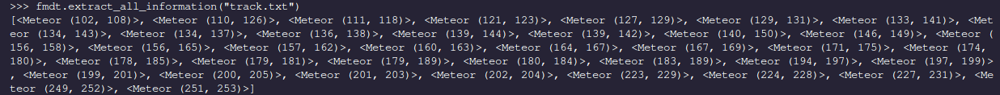

# High-Level Overview

In order to understand this library, both as a developer and as an end user, you only need to 
be familiar with the four fundamental classes: `Args`, `TrackedObject`, `HumanDetection`, and `GroundTruth`.
---
## Args

The `fmdt.args.Args` (aliased as `fmdt.Args`) class is used to represent a specific combination of arguments used to
run `fmdt`'s suite of executables.
##### Creation
We create a new `Args` object by providing a dictionary of the arguments that we want to use for `fmdt-detect`.

```
d_args_dict = {
    "light_min": 150,
    "light_max": 200,
    "trk_all": True
}

args = fmdt.Args(detect_args=d_args_dict)
```

We can use the `Args` class to call `fmdt.detect`:

```
d_args = {
    "vid_in_path": "demo.mp4",
    "trk_bb_path": "bbs.txt",
    "trk_path": "trk.txt",
    "light_min": 250,
    "light_max": 255
}

args = fmdt.Args(detect_args=d_args)
args = args.detect()
```

It's important to know that we can also create `Args` instances as the return type from a call to `fmdt.detect`:

```
res = fmdt.detect(vid_in_path="demo.mp4")
```

##### Chain together function calls

We can utilize the fact that a call to `fmdt.detect` returns an `Args` type and the fact that an `Args` type has the 
member functions `visu` and `detect` to chain together detection and visualization:

```
res = args.detect().visu()
```

## TrackedObject
A `TrackedOjbect` encodes the results of a call to `fmdt-detect`. A list of `TrackedObject` is our 
representation of the table of tracks outputted by `fmdt-detect` (corresponding to the `trk_path` parameter)

##### Creation

A list of `TrackedObject` can be retreived two different ways. The first involves a fresh call to `fmdt.detect` and 
uses the `Args` object that we just studied. In this method we **have** to specify the `trk_path` so that we 
can later retreive the data.

```
d_args = {
    "vid_in_path": "demo.mp4",
    "trk_path": "trk.txt"
    "light_min": 150,
    "light_max": 200
}

res = fmdt.detect(**d_args)

print(res.tracking_list) #! Actually a list of TrackedObject
```

Tada! We've actually already automatically been storing the results in our returned `Args`.

If the tracking table is already stored in a file ("track.txt" for example) and we want to just load it into Python, then we can use
the function `extract_all_information`:

```
fmdt.extract_all_information("track.txt")
```

which could return a list of `TrackedObject`:




---
# HumanDetection

A `HumanDetection` represents the blood, sweat, and tears of a human being that was spent to 
painstakenly detect a meteor. It records the video in which the meteor appears, start position, end position, and 
lifetime in terms of frames.

To see a complete list of the operations that can be performed, call `help(fmdt.HumanDetection)`

`HumanDetection` objects are compared with `TrackedObject`s to measure the performace of `fmdt-detect`.

##### Creation

A `HumanDetection` should not be instantiated manually. The creation of `HumanDetection`s is handled by the `GroundTruth`
class, which represents an individual database of `HumanDetection`.

Assuming that we have loaded in a `HumandDetection` (see [GroundTruth](#GroundTruth)) as `hum`, and a list of
`TrackedObject` as `objects`, we can go ahead and test for the presence of `hum` in `objects` with the
`is_meteor_detected()` function of the `fmdt.truth` module:

```
# hum is a fmdt.HumanDetection
# objects is a list[fmdt.TrackedObject]
hum_detected = fmdt.truth.is_meteor_detected(hum, objects)
```

which returns `True` if the `HumanDetection` `hum` matches up with any of the `TrackedObject`s in `objects`.

---
# GroundTruth

A `GroundTruth` represents a database of `HumanDetection` instances. For example, we can study the databases of the 
Draconids-6mm (draco6) and Draconids-12mm (draco12) separately. Two csv files containing a table of `HumanDetection` 
objects can be retrieved for [draco6](https://github.com/ejovo13/fmdt_python_clean/blob/build/human_detections_draco6.csv) and [draco12](https://github.com/ejovo13/fmdt_python_clean/blob/build/human_detections_draco12.csv)

###### Creation

In order to create a `GroundTruth` object, you need to have a csv containing a table of `HumanDetection`. If you would
like to actually analyze any aspects of the database you additionally need to have the _videos_ stored on your computer.

The following snipped of code will load in a `GroundTruth` object that will be used to study the draco6 videos. It works
because the csv file is in the current working directory and the draco6 videos files are stored physically on my disk
under the /home/ejovo/Videos/Watec6mm directory.

```
vid_dir  = "/home/ejovo/Videos/Watec6mm"
csv_file = "human_detections_draco6.csv"

gt6 = fmdt.GroundTruth(csv=csv_file, vid_dir=vid_dir)
```

We can go ahead and apply a single `Args` object across our entire `GroundTruth` database using the function 
`GroundTruth.try_command()`:

```
truth_detected = gt6.try_command(args) # use any fmdt.Args from before
```

which will store a list of booleans indicating whether or not the corresponding `HumanDetection` was found after 
a call to `fmdt-detect` with the parameters indicated by `Args`.

###### Heatmap

We can use a `GroundTruth` object combined with a linspace of `light_min` and `light_max` to create a heat map of which meteors were detected
usign the specified lumonisity parameters. To do so we simply call the function `GroundTruth.heat_map`, which has a similar argument
placement as numpy's `linspace`.

```
gt12.heat_map(150, 250, 20)
```