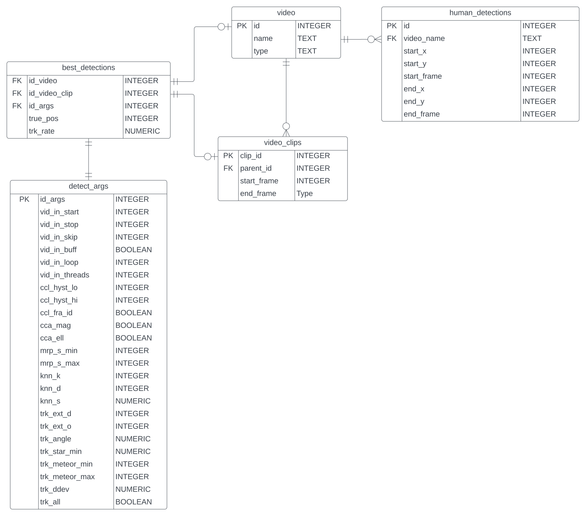

# SQL Database

Behind the surface of any `load_*` function is an SQL query. For example, 
`fmdt.load_demo()` exectutes the following SQL:

```sql
SELECT * FROM video WHERE name='2022_05_31_tauh_34_meteors.mp4'
```

and then converts the returned `pandas.DataFrame` into a single `Video`.

??? Note "Developer's Note"

    These SQL requests are powered by the python modules sqlite3 and pandas. 
    Each request is executed with a call to `pandas.read_sql_query()` whose 
    first argument is valid SQL and whose second argument is a connection to a 
    database. The following snippet shows how we perform the previous query to 
    retrieve our demo video.

    ```python
    import pandas as pd
    import sqlite3 
    import fmdt
    from os.path import join

    db_filename = join(fmdt.get_db_dir(), "videos.db")

    con = sqlite3.connect(db_filename)
    df = pd.read_sql_query("select * from video where name='2022_05_31_tauh_34_meteors.mp4'", con)  
    con.close()

    v = fmdt.Video.from_pd_row(df.iloc[0]) 
    print(v) # '2022_05_31_tauh_34_meteors.mp4'
    ```

We use a relational database powered by sqlite3 with the following Entity 
Relationship Diagram (using 
[crow's foot notation](http://www2.cs.uregina.ca/~bernatja/crowsfoot.html)):



For those familiar with SQL, you can inspect the contents of each table by 
accessing the database located in `$DB_DIR/videos.db`, where `$DB_DIR` is the 
string returned by `fmdt.get_db_dir()`:

```python
>>> import fmdt
>>> import os
>>> fmdt.get_db_dir()
'/home/ejovo/.local/share/fmdt_python'
>>> os.listdir(fmdt.get_db_dir())
['human_detections_draco6.csv',
 'human_detections_draco12.csv',
 'human_detections.csv',
 'videos.db',                         # sqlite3 database file
 'config.json',
 'gt6.csv',
 'gt12.csv']
```

# Video Database

Our video database is split into three categories: `Draco6`, `Draco12`, and 
`Window`. 

=== "Draco6"

    ``` bash
    ~/Videos/Watec6mm/
    ├── Draconids-6mm1.00-2750-163200.avi
    ├── Draconids-6mm1.05-0750-164200.avi
    ├── Draconids-6mm1.14-1400-170300.avi
    ├── Draconids-6mm1.20-2350-171600.avi
    ├── Draconids-6mm1.29-2550-173600.avi
    ├── Draconids-6mm1.30-2050-173800.avi
    ├── Draconids-6mm1.32-3150-174200.avi
    ├── Draconids-6mm1.34-3050-174700.avi
    ├── Draconids-6mm2.00.01-1000-201100.avi
    ├── Draconids-6mm2.00.01-1500-201200.avi
    ├── Draconids-6mm2.00.01-2150-201200.avi
    ├── Draconids-6mm2.00.02-0700-201300.avi
    ├── Draconids-6mm2.00.03-0450-201500.avi
    ├── Draconids-6mm2.00.03-0550-201500.avi
    ├── Draconids-6mm2.00.03-0950-201500.avi
    ├── Draconids-6mm2.00.04-1500-201800.avi
    ├── Draconids-6mm2.00.04-1900-201900.avi
    ├── Draconids-6mm2.00.04-2950-201900.avi
    ├── Draconids-6mm2.00.05-0120-202000.avi
    ├── Draconids-6mm2.00.05-0200-202000.avi
    ├── Draconids-6mm2.00.05-0350-202000.avi
    ├── Draconids-6mm2.00.07-0900-202400.avi
    ├── Draconids-6mm2.00.07-2400-202500.avi
    ├── Draconids-6mm2.00.07-3000-202530.avi
    ├── Draconids-6mm2.00.09-0600-202900.avi
    ├── Draconids-6mm2.00.09-1650-203000.avi
    ├── Draconids-6mm2.00.09-3000-203030.avi
    ├── Draconids-6mm2.00.10-0300-203100.avi
    ├── Draconids-6mm2.00.10-0350-203110.avi
    ├── Draconids-6mm2.00.10-1050-203200.avi
    ├── Draconids-6mm2.00.11-2100-203400.avi
    ├── Draconids-6mm2.00.11-680-203300.avi
    ├── Draconids-6mm2.00.11-780-203310.avi
    ├── Draconids-6mm2.00.12-1550-203600.avi
    ├── Draconids-6mm2.00.12-2550-203700.avi
    ├── Draconids-6mm2.00.12-3100-203730.avi
    ├── Draconids-6mm2.00.13-0680-203800.avi
    ├── Draconids-6mm2.00.13-3100-204000.avi
    ├── Draconids-6mm2.00.15-0750-204200.avi
    ├── Draconids-6mm2.00.15-2300-204300.avi
    ├── Draconids-6mm2.00.15-2850-204330.avi
    ├── Draconids-6mm2.00.170050-204700.avi
    ├── Draconids-6mm2.00.18-0000-204900.avi
    ├── Draconids-6mm2.00.18-2850-205000.avi
    ├── Draconids-6mm2.00.19-0680-205100.avi
    ├── Draconids-6mm2.00.19-1550-205200.avi
    ├── Draconids-6mm2.00.20-2600-205500.avi
    ├── Draconids-6mm2.00.20-2900-205510.avi
    ├── Draconids-6mm2.00.22-3150-205900.avi
    ├── Draconids-6mm2.00.25-2250-210600.avi
    ├── Draconids-6mm2.00.26-450-210700.avi
    └── Draconids-6mm2.00.28-1950-211200.avi
    ```
    
=== "Draco12"
    ```bash
    ~/Videos/Watec6mm/
    ├── Draconids-12mm1.01-1950-163100.avi
    ├── Draconids-12mm1.02-1500-163500.avi
    ├── Draconids-12mm1.09-800-164900.avi
    ├── Draconids-12mm1.11-150-165300.avi
    ├── Draconids-12mm1.13-1350-165800.avi
    ├── Draconids-12mm1.15-650-170200.avi
    ├── Draconids-12mm1.16-250-170400.avi
    ├── Draconids-12mm1.19-2400-171200.avi
    ├── Draconids-12mm1.20-650-171300.avi
    ├── Draconids-12mm1.26-3100-172700.avi
    ├── Draconids-12mm1.27-2800-173000.avi
    ├── Draconids-12mm1.28-350-173100.avi
    ├── Draconids-12mm1.30-1700-173600.avi
    ├── Draconids-12mm1.33-2350-174300.avi
    ├── Draconids-12mm2.00.01-3000-201200.avi
    ├── Draconids-12mm2.00.01-3100-201200.avi
    ├── Draconids-12mm2.00.02-1550-201300.avi
    ├── Draconids-12mm2.00.02-2950-201400.avi
    ├── Draconids-12mm2.00.03-2000-201600.avi
    ├── Draconids-12mm2.00.03-550-201500.avi
    ├── Draconids-12mm2.00.04-1550-201900.avi
    ├── Draconids-12mm2.00.04-2550-201900.avi
    ├── Draconids-12mm2.00.04-750-201800.avi
    ├── Draconids-12mm2.00.05-150-202000.avi
    ├── Draconids-12mm2.00.05-1600-202100.avi
    ├── Draconids-12mm2.00.05-2900-202100.avi
    ├── Draconids-12mm2.00.05-2950-202100.avi
    ├── Draconids-12mm2.00.06-1400-202200.avi
    ├── Draconids-12mm2.00.08-3250-202700.avi
    ├── Draconids-12mm2.00.09-1250-202900.avi
    ├── Draconids-12mm2.00.09-1450-202900.avi
    ├── Draconids-12mm2.00.11-650-203300.avi
    ├── Draconids-12mm2.00.14-800-204000.avi
    ├── Draconids-12mm2.00.15-1850-204300.avi
    ├── Draconids-12mm2.00.15-2950-204300.avi
    ├── Draconids-12mm2.00.15-3050-204300.avi
    ├── Draconids-12mm2.00.21-1250-205500.avi
    ├── Draconids-12mm2.00.22-2250-205900.avi
    ├── Draconids-12mm2.00.27-1750-210900.avi
    ├── Draconids-12mm2.00.28-1800-211100.avi
    └── Draconids-12mm2.00.28-2400-211200.avi
    ```

=== "Window"

    ```bash
    ~/Videos/Window/
    ├── 2022_05_31_tauh_34_meteors.mp4  # Sometimes referred to as demo.mp4 in old tutorials
    ├── window_3_sony_0400-0405UTC.mp4
    ├── window_3_sony_0405-0410UTC.mp4
    ├── window_3_sony_0410-0415UTC.mp4
    ├── window_3_sony_0415-0420UTC.mp4
    ├── window_3_sony_0420-0425UTC.mp4
    ├── window_3_sony_0425-0430UTC.mp4
    └── window_3_sony_0500-0505UTC.mp4
    ```

    Each `window*` video is 5 minutes long and contains several ground truths.

    Within each `window` video there are several meteors. 