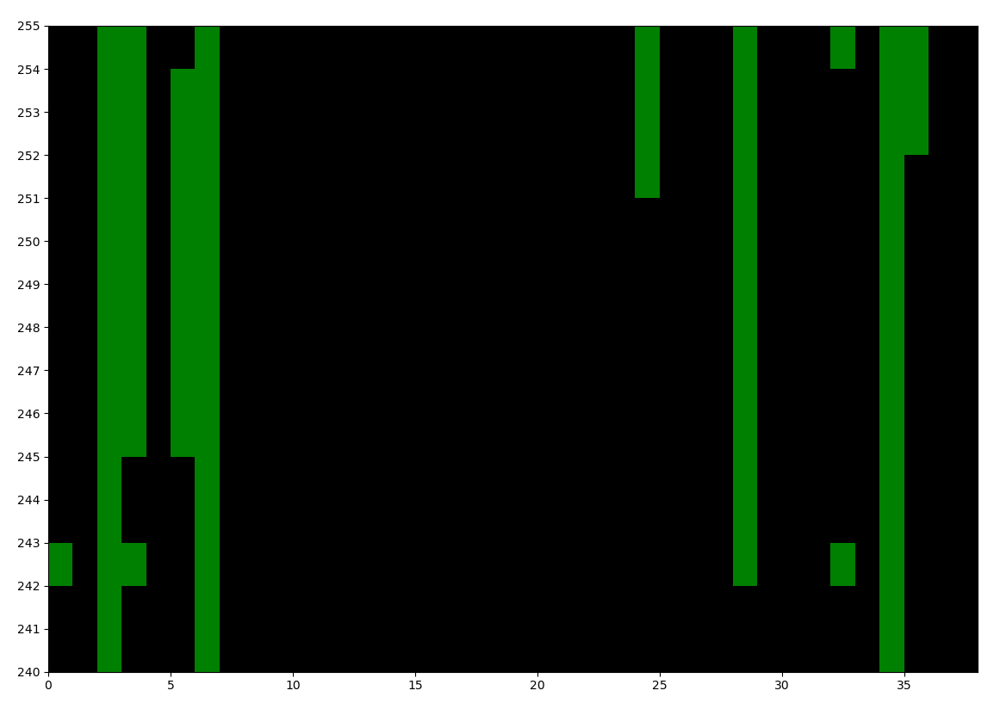

# GroundTruth Testing
Companion script: [test_ground_truth.py](https://github.com/ejovo13/fmdt_python_clean/blob/main/test_ground_truth.py)

---

### Attention

Version `0.0.25` of `fmdt-python` updated the way we access the database.

In this guide you'll learn how to use `fmdt` to test the performance of `fmdt-detect`. The relevant
functions for ground truth testing are stored in the `fmdt.truth` module.
## Config

If you haven't already configured `fmdt` (or you don't know that that means), follow [this guide](../howto/0_initialization.md).


## Loading GroundTruths 

We have several utility functions to load up the `GroundTruth` objects corresponding to Draco6 (`gt6`), Draco12 (`gt12`), and window (`gtw`).

```
gt6  = fmdt.load_gt6()
gt12 = fmdt.load_gt12()
# gtw  = fmdt.load_gtw() Not implemented yet!
```

---

```
>>> gt6
<fmdt.truth.GroundTruth object at 0x7f590d0939d0>

>>> print(gt6)
GroundTruth with 38 detections, 38 unique videos, and db dir:
        /home/ejovo/Videos/Watec6mm

>>> print(gt12)
GroundTruth with 39 detections, 39 unique videos, and db dir:
        /home/ejovo/Videos/Watec12mm
```

## Testing a configuration of parameters

Specify a set of arguments and then see which `HumanDetection`s are detected.

```
args = fmdt.detect_args(light_min=253, light_max=255, trk_all=True)
success_list = gt6.try_command(args)
```
---

```
>>> success_list
[False, False, True, True, False, True, True, False, False, False, False, False, False, False, False, False, False, False, False, False, False, False, False, False, True, False, False, False, False, False, False, False, False, False, True, True, False, False]

>>> sum(success_list)
7
```

## Heatmap

Create a heatmap (sort of) of the meteors that are detected for different `[light_min, light_max]` intervals with the `draw_heatmap()` function:

```
gt6.draw_heatmap(lmin_min=240, lmax_max=255, n_intervals=5)
```

