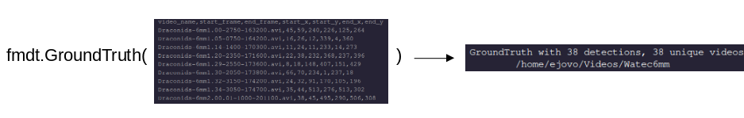

# GroundTruth Testing
Companion script: [test_ground_truth.py]()

---

In this guide you'll learn how to use `fmdt` to test the performance of `fmdt-detect`. The relevant
functions for ground truth testing are stored in the `fmdt.truth` module.

## Loading the Database

Currently there are two ground truth databases accessible. Files of the form 
`Draconids-6mm*` (denoted draco6) and `Draconids-12mm*` (denoted draco12) have their
ground truths stored in the [draco6](https://github.com/ejovo13/fmdt_python_clean/blob/build/human_detections_draco12.csv) and [draco12](https://github.com/ejovo13/fmdt_python_clean/blob/build/human_detections_draco6.csv) csv files. 

These two database files contain the ground truth values that will be loaded into python as
`GroundTruth` objects, which are essentially a list of `HumanDetection` paired with helpful
functions. Let's start by creating a `GroundTruth` object corresponding to the draco6 videos.

### draco6

To create a new `GroundTruth`, we have to pass in the name of the database file + a path 
to where those videos are stored on your machine.

```
vid_dir_path = "~/Videos/Watec6mm"        # Path to draco6 videos on my machine
draco6_db    = "human_detections_draco6.csv"

gt6 = fmdt.GroundTruth(csv=draco6_db, vid_dir_path=vid_dir_path)
```

The operation we are performing is the following:



Once we have loaded in a `GroundTruth` object, we can access its list of `TrackedObjects`
via the `.meteors` field:

```
print(type(gt6.meteors))    # list
print(type(gt6.meteors[0])) # fmdt.truth.HumanDetection
```

To see a complete list of members and functions, consult `help(fmdt.GroundTruth)` or `help(fmdt.HumanDetection)`

### Testing a single command

In this section we test our database by holding the **configuration** of fmdt-detect 
constant and applying this fixed assortment of parameters across all videos to see 
which meteors were able to be detected. 

For example, consider the set of arguments

- `--light_min 150`
- `--light_max 200`
- `--trk-meteor-min 5`

We can encode this in an `fmdt.Args` object in two steps: defining a dictionary of 
detect arguments followd by a call to the `Args` constructor.

```
d_args = {
    "light_min": 150,
    "light_max": 200,
    "trk_meteor_min": 5
}

args = fmdt.Args(detect_args=d_args)
```

We can then go ahead and use the function `GroundTruth.try_command()` in order to 
test which meteors are detected by this set of arguments:

```
success_list = gt6.try_command(args)
```

The function `try_command()` returns a `list[bool]` where a `True` indicates successful
detection of the corresponding meteor. Later editions will feature a more sophisticated
result that provides more information than a binary `True/False`.

In practice some of the `fmdt-detect` commands using this configuration of parameters will fail,
causing the process to hang. To speed up testing of our database, we can optionally
include a `timeout` parameter for our `detect_args`:

```
d_args = {
    "light_min": 150,
    "light_max": 200,
    "trk_meteor_min": 5,
    "timeout": 1          # timeout in seconds for the fmdt-detect subprocess
}
```