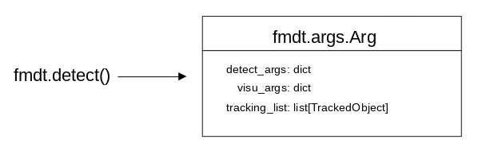

# 2. Loading Tracked Objects

Learning Goal: Understand how to inspect the output of `fmdt-detect`.

---

In this tutorial we are going to take a look into how we can examine the list of 
objects detected by a call to `fmdt-detect`.

## Detection

We start with a simple detection, continuing to use 
[demo.mp4](https://lip6.fr/adrien.cassagne/data/tauh/in/2022_05_31_tauh_34_meteors.mp4) 
as our prototype video. 

```Python
import fmdt

vid_in = "demo.mp4"
trk    = "trk.txt"

res = fmdt.detect(vid_in_path=vid_in, trk_path=trk, trk_all=True)
```

This time, however, we pass in `trk_all=True` to indicate to `fmdt-detect` to 
track all celestial objects (stars, meteors & noise) and we also store the 
results of a call to `fmdt.detect` in the `res` variable. The return of 
`fmdt.detect` is a `fmdt.res.DetectionResult`.

**TODO: Insert image here**

We will study the `DetectionResult` more in depth in later tutorials. For now, 
we are interested in it's `trk_list` member, which contains a list of all the 
objects detected by `fmdt-detect`.

## Tracking List

The `--trk-path` parameters tells `fmdt-detect` where to store its list of 
tracked objects. This entity, which we refer to as a Tracking List, is very 
useful for analyzing the performance of `fmdt-detect`.

<!-- Here we are actually creating a DetectionResult and not an Args -->
<!--  -->

We can examine this tracking list by accessing the 
`trk_list: list[TrackedObject]` field of our `res`.

```Python
print(type(res))             # fmdt.res.DetectionResult
print(type(res.trk_list))    # list
print(type(res.trk_list[0])) # fmdt.core.TrackedObject
```

Remember that if we ever want more information about a class we can just call 
`help(ClassName)`. We can see how many total objects were detected by inquiring 
the length of `trk_list`:

```Python
print(len(res.trk_list)) # 83
```

```Python
for i in range(10):
    print(res.trk_list[i])
```

```Python
<Noise (4, 255), pos0: ((643.9, 832.0)), posT: (644.0, 831.9)>
<Noise (4, 255), pos0: ((562.9, 860.5)), posT: (563.8, 861.8)>
<Star (0, 255), pos0: ((909.5, 131.7)), posT: (909.2, 131.7)>
<Star (0, 255), pos0: ((242.6, 138.4)), posT: (242.3, 138.4)>
<Star (0, 255), pos0: ((1639.4, 209.5)), posT: (1639.6, 209.1)>
<Star (0, 255), pos0: ((1099.3, 281.6)), posT: (1099.4, 281.5)>
<Star (0, 255), pos0: ((694.2, 309.4)), posT: (694.1, 309.1)>
<Star (0, 255), pos0: ((1102.4, 361.9)), posT: (1103.0, 361.6)>
<Star (0, 255), pos0: ((1311.2, 451.6)), posT: (1311.5, 451.6)>
<Star (0, 255), pos0: ((240.7, 481.6)), posT: (240.8, 482.0)>
```

<!--  -->

We can retain only the meteors (or stars, noise) by using Python's list 
comprehension and our `TrackedObject` class:

```Python
meteors = [m for m in res.trk_list if m.is_meteor()]
stars   = [s for s in res.trk_list if s.is_star()]
noise   = [n for n in res.trk_list if n.is_noise()]
```

because the `TrackedObject` class comes equipped with the three utility 
functions `.is_meteor()`, `.is_start()`, and `.is_noise()`

Alternatively, retrieve these lists with the `.meteors()`, `.stars()`, and 
`.noise()` functions of our `res`:

```Python
meteors = res.meteors()
stars   = res.stars()
noise   = res.noise()
```

## Conclusion

This tutorial taught you how to load, filter, and examine the list of objects 
that are detected by `fmdt-detect` (and stored in the `trk_path` file). We will 
use this tracking list often when evaluating the performance of `fmdt-detect` 
with our database of videos. Keep following along to 
[the next section](3_Playing_with_args.md) to learn how to play around with 
different argument combinations or read up on the `DetectionResult` class 
[here](../reference/res.md).
