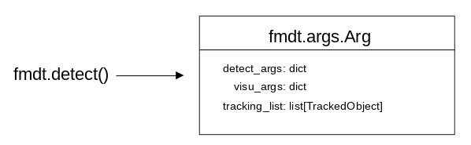
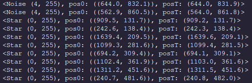

In this tutorial we are going to take a look into how we can examine the 
list of objects detected by a call to `fmdt-detect`.

We'll continue to use [demo.mp4](https://lip6.fr/adrien.cassagne/data/tauh/in/2022_05_31_tauh_34_meteors.mp4) 
as our prototype video.

```{Python}
import fmdt

vid_in  = "demo.mp4"
tracks  = "tracks.txt"
bb      = "bb.txt"
trk_all = True

res = fmdt.detect(vid_in_path=vid_in, trk_out_path=tracks, trk_bb_path=bb, trk_all=trk_all)
```

The `res` object is a `fmdt.args.Arg` whose purpose is to capture configurations of 
parameters used to execute `fmdt`'s executables:



We can examine the stored list of `TrackedObject` by accessing the `tracking_list` field. 
Let's look at the first 10 tracked objects:

```{Python}
print(len(res.tracking_list)) # 82

for i in range(10):
    print(res.tracking_list[i])
```



We can retain only the meteors by using Python's list comprehension and our `TrackedObject`
class:

```{Python}
meteors = [m for m in res.tracking_list if m.is_meteor()]
```

The `TrackedObject` class comes equipped with the three utility functions `.is_meteor()`,
`.is_start()`, and `.is_noise()`

```{Python}
print(meteors)
```
